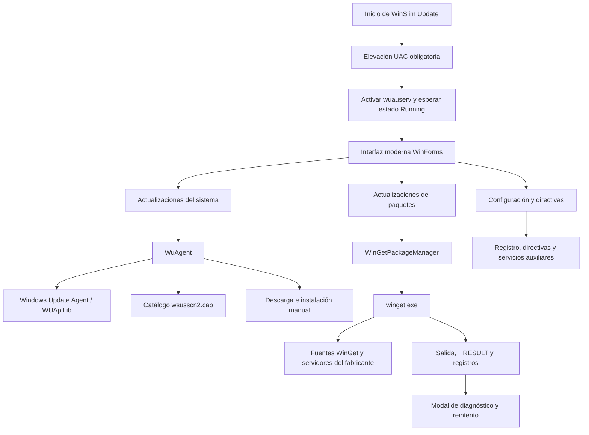

<h1 align="center">WinSlim Update</h1>

<h3 align="center">Control moderno y explícito de las actualizaciones de Windows y aplicaciones</h3>

<p align="center"><strong>Windows 10 / 11 · Windows Forms · .NET Framework 4.6.1 · WinGet · Windows Update Agent</strong></p>

<p align="center"><code>Versión 3.0.3</code> · <code>Any CPU</code> · <code>UAC obligatorio</code> · <code>GPL-3.0</code></p>

> [!IMPORTANT]
> WinSlim Update no instala actualizaciones por iniciativa propia. La búsqueda, selección e instalación siguen dependiendo de las acciones y de la configuración elegidas por el usuario.

---


---

## Índice

- [Descripción](#descripción)
- [Principios del proyecto](#principios-del-proyecto)
- [Funciones principales](#funciones-principales)
- [Interfaz y navegación](#interfaz-y-navegación)
- [Arquitectura](#arquitectura)
- [Actualizaciones del sistema](#actualizaciones-del-sistema)
- [Actualizaciones de paquetes](#actualizaciones-de-paquetes)
- [Diagnóstico de errores](#diagnóstico-de-errores)
- [Configuración](#configuración)
- [Seguridad y privilegios](#seguridad-y-privilegios)
- [Datos, archivos y privacidad](#datos-archivos-y-privacidad)
- [Estructura del código](#estructura-del-código)
- [Compilación](#compilación)
- [Opciones de línea de comandos](#opciones-de-línea-de-comandos)
- [Limitaciones conocidas](#limitaciones-conocidas)
- [Historial reciente](#historial-reciente)
- [Créditos y licencias](#créditos-y-licencias)

---

## Descripción

WinSlim Update es una aplicación de escritorio para administrar desde una sola interfaz dos clases de mantenimiento claramente separadas:

1. **Actualizaciones del sistema**, obtenidas mediante la API nativa de Windows Update.
2. **Actualizaciones de aplicaciones**, detectadas e instaladas mediante WinGet.

El proyecto parte de la base técnica de **WuMgr**, pero sustituye gran parte de su presentación por una interfaz moderna, oscura y completamente en español. La versión 3 incorpora un segundo motor para aplicaciones inspirado en el flujo de UniGetUI, sin mezclar sus resultados con las actualizaciones del sistema.

| Dato | Valor |
|---|---|
| Versión documentada | 3.0.3 |
| Plataforma | Windows 10 y Windows 11 |
| Interfaz | Windows Forms personalizada |
| Runtime | .NET Framework 4.6.1 |
| Arquitectura de compilación | Any CPU, sin preferencia por 32 bits |
| Motor del sistema | Windows Update Agent mediante COM |
| Motor de aplicaciones | WinGet CLI |
| Elevación | Administrador obligatorio mediante manifiesto UAC |
| Licencia principal | GNU GPL v3 |

---

## Principios del proyecto

### Control explícito

Las acciones importantes se inician desde la interfaz. WinSlim Update permite revisar las actualizaciones encontradas, marcar elementos concretos y decidir si se descargan, instalan, ocultan o desinstalan.

### Separación de motores

Las actualizaciones de Windows y las de aplicaciones se muestran en apartados distintos. Cada motor conserva sus propios estados, operaciones, errores y registros.

### Diagnósticos comprensibles

Los errores se presentan con una explicación útil, conservando al mismo tiempo el código técnico, el comando ejecutado y la evidencia completa para facilitar soporte y depuración.

### Interfaz coherente

Listados, casillas, categorías, desplazamiento, estados vacíos, botones y diálogos comparten una estética oscura en negro, grafito, blanco y plata.

---

## Funciones principales

| Área | Capacidades |
|---|---|
| Windows Update | Buscar, descargar, instalar, ocultar, volver a mostrar y consultar actualizaciones |
| Historial | Mostrar operaciones anteriores y sus resultados |
| Instaladas | Consultar actualizaciones presentes y desinstalar solo las que Windows marque como extraíbles |
| Controladores | Incluirlos o excluirlos mediante la directiva correspondiente |
| Microsoft Update | Añadir productos de Microsoft además de Windows |
| Catálogo offline | Descargar y utilizar `wsusscn2.cab` para búsquedas sin conexión |
| Modo manual | Descargar archivos e instalarlos mediante el flujo manual de WinSlim Update |
| Aplicaciones | Detectar actualizaciones de paquetes instalados mediante WinGet |
| Selección de paquetes | Marcar paquetes individualmente, seleccionar todos y filtrar por texto o fuente |
| Diagnóstico WinGet | Interpretar HRESULT, códigos Win32, MSI y errores comunes de instaladores EXE |
| Actividad | Mostrar el registro de la sesión dentro de la propia aplicación |
| Directivas | Ajustar el comportamiento automático de Windows Update, Store y otros componentes relacionados |

---

## Interfaz y navegación

La barra lateral divide la aplicación en tres grupos conceptuales.

### Actualizaciones

- **Disponibles**: actualizaciones pendientes encontradas por Windows Update.
- **Instaladas**: elementos ya presentes en el equipo.
- **Ocultas**: actualizaciones excluidas que pueden volver a mostrarse.
- **Historial**: resultado de operaciones anteriores.

### Aplicaciones

- **Actualizaciones de paquetes**: aplicaciones instaladas para las que WinGet ofrece una versión nueva.

### Configuración

- **Configuración**: origen, catálogo offline, Microsoft Update, automatización y directivas.

El botón de menú de la esquina superior izquierda se mantiene deliberadamente simple:

- **Acerca de**: versión, autoría, proyectos de origen y licencias.
- **Salir**: cierra la aplicación.

Desde la versión 3.0.3 no existe un submenú visual de herramientas ni un interruptor para desactivar el servicio de Windows Update.

---

## Arquitectura

WinSlim Update utiliza una interfaz común, pero mantiene dos recorridos de actualización independientes.



### Capas principales

| Capa | Responsabilidad |
|---|---|
| Presentación | Navegación, tarjetas, controles modernos, estados y diálogos |
| Dominio Windows Update | Búsqueda, historial, descarga, instalación, ocultación y desinstalación |
| Dominio de paquetes | Consulta y actualización de aplicaciones mediante WinGet |
| Diagnóstico | Traducción de códigos, lectura de registros y explicación de causas |
| Sistema | UAC, servicios, directivas, archivos, IPC y configuración INI |

---

## Actualizaciones del sistema

### Flujo de inicio

1. Windows solicita permisos de administrador mediante el manifiesto `requireAdministrator`.
2. La aplicación configura `wuauserv` con inicio manual.
3. Si el servicio está detenido o pausado, lo inicia o reanuda.
4. Espera hasta 15 segundos a que alcance el estado **Running**.
5. Inicializa Windows Update Agent y carga los proveedores disponibles.
6. Presenta la lista correspondiente o queda preparada para buscar.

> [!NOTE]
> Mantener `wuauserv` activo no obliga a Windows a instalar actualizaciones automáticamente. El servicio solo queda disponible para que el agente pueda atender las operaciones iniciadas desde WinSlim Update.

### Búsqueda

La búsqueda utiliza las interfaces COM de Windows Update. Según la configuración puede consultar:

- Windows Update.
- Microsoft Update, incluyendo otros productos de Microsoft.
- Un proveedor indicado mediante argumentos avanzados.
- El catálogo offline `wsusscn2.cab`.

### Acciones disponibles

- **Instalar**: solicita a Windows Update Agent la instalación de los elementos marcados.
- **Descargar**: descarga los archivos sin instalarlos.
- **Ocultar**: excluye una actualización de las búsquedas normales.
- **Volver a mostrar**: devuelve una actualización oculta al flujo normal.
- **Desinstalar**: solo está disponible cuando Windows indica que el paquete admite retirada.
- **Abrir soporte**: utiliza el enlace de soporte asociado a la actualización.
- **Copiar enlaces**: recupera los enlaces directos de descarga cuando están disponibles.

### Listado moderno

`ModernUpdateList` sustituye la presentación clásica de `ListView` por un control propio con:

- Doble búfer para reducir parpadeos.
- Casillas y filas dibujadas sobre una única superficie.
- Categorías plegables.
- Selección por ratón y teclado.
- Barras de desplazamiento integradas.
- Anchos de columna ajustables.
- Estados vacíos y tooltips adaptados al tema oscuro.

---

## Actualizaciones de paquetes

Este apartado es independiente de Windows Update y utiliza el ejecutable WinGet registrado para el usuario actual.

### Detección

El motor ejecuta una consulta equivalente a:

```powershell
winget upgrade --include-unknown --accept-source-agreements --disable-interactivity
```

La salida tabular se interpreta a partir de la posición de las columnas, reduciendo la dependencia del idioma de los encabezados. De cada paquete se conserva:

- Nombre.
- ID de WinGet.
- Versión instalada.
- Versión disponible.
- Fuente.
- Estado y selección.

### Interacción

El usuario puede:

- Buscar nuevamente.
- Filtrar por nombre, ID o versión.
- Agrupar o filtrar por fuente.
- Ordenar las columnas.
- Seleccionar uno, varios o todos los paquetes.
- Cancelar una operación en curso.
- Actualizar la selección de forma secuencial.

### Instalación

Para cada paquete se construye una orden equivalente a:

```powershell
winget upgrade --id <ID> --exact --source <FUENTE> `
  --include-unknown `
  --accept-source-agreements `
  --accept-package-agreements `
  --disable-interactivity `
  --silent `
  --verbose-logs
```

Las actualizaciones se procesan de una en una. Esto permite conocer el resultado concreto de cada paquete, reintentar únicamente el que falla y continuar con los siguientes.

> [!WARNING]
> Algunos instaladores diseñados exclusivamente para el ámbito del usuario prohíben ejecutarse desde un proceso elevado. WinSlim Update explica los códigos de WinGet correspondientes, pero no omite la elevación global exigida por la aplicación.

---

## Diagnóstico de errores

### Windows Update

Cuando una instalación del sistema falla, se conserva:

- HRESULT devuelto por Windows.
- Actualización afectada.
- Descripción conocida del código.
- Resultado global y posibles instalaciones parciales.
- Indicación de reinicio cuando Windows la comunica.

Entre los códigos reconocidos se incluyen errores del almacén de componentes, acceso denegado, archivos ausentes, actualización no aplicable, otra instalación en curso y reinicio pendiente.

### WinGet e instaladores

El diagnóstico de paquetes combina varias fuentes de evidencia, en este orden:

1. Causas específicas verificadas en el registro del instalador.
2. Patrones reconocibles en la salida: incompatibilidad, archivo en uso, falta de espacio, red, permisos, dependencias, políticas o reinicio.
3. Código interno del instalador MSI o EXE cuando WinGet lo expone.
4. Código HRESULT oficial de WinGet.
5. HRESULT de Win32 encapsulado, como `0x80070005`.
6. Salida y registros completos cuando no existe una interpretación estándar fiable.

El analizador conoce las familias principales `0x8A1500xx` y `0x8A1501xx`, además de códigos habituales de Windows Installer como `1603`, `1618`, `1638` y `3010`.

### Registros consultados

- Salida estándar y salida de error de WinGet.
- Registro reciente de WinGet en `DiagOutputDir`.
- Archivos `.log` mencionados por WinGet.
- Archivos `.txt` cuyo nombre identifica claramente un registro.
- Registros específicos conocidos, como `install-log-admin.txt` de Docker Desktop.

Cada archivo se limita a sus últimos 64 000 caracteres para evitar diálogos excesivamente grandes.

### Modal de error

Cuando un paquete falla, el modal muestra:

- Nombre del paquete.
- Causa resumida en lenguaje natural.
- Código WinGet en hexadecimal.
- Interpretación técnica.
- Comando ejecutado.
- Versiones, fuente y contexto de administrador.
- Salida y registros completos.

Acciones disponibles:

- **Reintentar**: repite únicamente el paquete afectado.
- **Copiar diagnóstico**: copia toda la evidencia al portapapeles.
- **Cerrar**: registra el fallo y continúa con el siguiente paquete.

---

## Configuración

### General

| Opción | Efecto |
|---|---|
| Origen | Selecciona Windows Update, Microsoft Update u otro proveedor disponible |
| Usar catálogo sin conexión | Cambia la búsqueda al catálogo `wsusscn2.cab` |
| Actualizar catálogo offline | Descarga una copia nueva antes de utilizarla |
| Usar modo manual | Emplea el flujo de descarga e instalación manual del proyecto |
| Incluir reemplazadas | Permite mostrar actualizaciones sustituidas por otras más recientes |
| Incluir Microsoft Update | Registra o retira el proveedor de Microsoft Update |
| Ejecutar en segundo plano | Inicia la aplicación minimizada en el área de notificación |
| Comprobación periódica | Configura la frecuencia de búsquedas automáticas |
| Ejecutar como administrador | Opción heredada; desde la versión 3 el manifiesto ya exige UAC siempre |

### Control de Windows Update

| Opción | Efecto |
|---|---|
| Bloquear servidores de Microsoft | Configura directivas para impedir la conexión normal a los servidores públicos |
| Desactivar actualización automática | Establece `NoAutoUpdate` mediante directiva |
| Solo avisar | Windows notifica antes de descargar o instalar |
| Descargar sin instalar | Permite la descarga automática, conservando la instalación manual |
| Instalación programada | Define día y hora para el comportamiento automático de Windows |
| Comportamiento automático | Devuelve la configuración al comportamiento predeterminado |
| Desactivar servicios auxiliares | Deshabilita Update Orchestrator y Windows Update Medic; es una opción avanzada y de alto impacto |
| Ocultar la página de Windows Update | Oculta esa página en la aplicación Configuración de Windows |
| Desactivar actualizaciones de Store | Modifica la directiva de descarga automática de Microsoft Store |
| Incluir controladores | Controla la directiva que excluye o incluye controladores en Windows Update |

> [!CAUTION]
> Las opciones de bloqueo y servicios auxiliares modifican directivas o claves del sistema. Deben utilizarse conociendo su efecto y pueden comportarse de forma distinta según la edición y compilación de Windows.

---

## Seguridad y privilegios

### UAC obligatorio

El manifiesto integrado utiliza:

```xml
<requestedExecutionLevel level="requireAdministrator" uiAccess="false" />
```

La elevación es necesaria para instalar o retirar actualizaciones, modificar servicios y aplicar directivas de máquina. Los procesos de WinGet iniciados por la aplicación heredan el token elevado.

### Servicio de Windows Update protegido desde la interfaz

Desde la versión 3.0.3:

- `wuauserv` se habilita internamente con inicio manual.
- La aplicación espera a que el servicio esté ejecutándose antes de iniciar el agente.
- No existe ningún control visual para detenerlo o deshabilitarlo.
- Se eliminaron las rutas heredadas de configuración que podían deshabilitarlo al cerrar.

### Ejecución única

`PipeIPC` evita mantener varias instancias normales simultáneas. Si se intenta abrir otra, la nueva instancia solicita a la existente que vuelva a mostrarse.

### Instalaciones explícitas

WinSlim Update no inicia una instalación de sistema o paquete sin una acción del usuario o una automatización previamente configurada. WinGet recibe automáticamente la aceptación de los acuerdos de fuente y paquete cuando el usuario inicia una actualización.

---

## Datos, archivos y privacidad

### Directorio de trabajo

La aplicación intenta utilizar su propia carpeta como directorio de trabajo. Si no puede escribir en ella, utiliza:

```text
%USERPROFILE%\Downloads\WuMgr
```

### Archivos principales

| Archivo o carpeta | Contenido |
|---|---|
| `wumgr.ini` | Preferencias generales de la aplicación |
| `Updates.ini` | Metadatos utilizados por algunos listados de la interfaz |
| `Updates\` | Descargas manuales y catálogo offline |
| `Updates\updates.ini` | Metadatos de actualizaciones descargadas |
| `Translation.ini` | Traducciones externas opcionales |
| `wsusscn2.cab` | Catálogo offline de Microsoft |
| `CHANGELOG.md` | Historial detallado de versiones |

### Registros de WinGet

WinGet mantiene sus registros normalmente bajo:

```text
%LOCALAPPDATA%\Packages\Microsoft.DesktopAppInstaller_8wekyb3d8bbwe\LocalState\DiagOutputDir
```

WinSlim Update lee el registro reciente relacionado con la operación para mostrarlo en el diagnóstico; no lo sube a ningún servidor propio.

### Privacidad

El proyecto no incluye telemetría propia, cuentas de usuario ni un backend de WinSlim Update. La información de actualizaciones se procesa localmente. Las búsquedas y descargas sí establecen las conexiones normales necesarias con Microsoft, las fuentes de WinGet y los servidores de los fabricantes.

Consulta también [PRIVACY_POLICY.md](PRIVACY_POLICY.md).

---

## Estructura del código

```text
WinSlim Update 3.0/
├── wumgr.sln
├── build-release.ps1
├── README.md
├── DOCUMENTACION.md
├── CHANGELOG.md
├── LICENSE
├── PRIVACY_POLICY.md
├── THIRD_PARTY_NOTICES.md
├── Tools/
│   └── Defender Update/          # Recursos heredados, sin menú visible
└── wumgr/
    ├── Program.cs                # Entrada, UAC, instancia única y directorios
    ├── WuMgr.cs                  # Coordinación principal de la ventana
    ├── WuMgr.Designer.cs         # Controles WinForms heredados
    ├── ModernUi.cs               # Composición y estilo de la interfaz moderna
    ├── WuAgent.cs                # Motor de Windows Update Agent
    ├── MsUpdate.cs               # Modelo de actualización del sistema
    ├── UpdateDownloader.cs       # Descarga manual
    ├── UpdateInstaller.cs        # Instalación manual
    ├── UpdateErrors.cs           # Descripciones de errores de Windows Update
    ├── GPO.cs                    # Directivas, Store, controladores y servicios
    ├── PackageUpdates.cs         # Página y flujo de paquetes
    ├── PackageUpdateErrorDialog.cs
    ├── Common/
    │   ├── WinGetPackageManager.cs
    │   ├── ModernUpdateList.cs
    │   ├── AppLog.cs
    │   ├── PipeIPC.cs
    │   ├── ServiceHelper.cs
    │   └── ...
    ├── lib/
    │   ├── Interop.WUApiLib.dll
    │   └── Interop.TaskScheduler.dll
    ├── res/                      # Recursos gráficos de Icons8
    ├── app.manifest
    ├── App.config
    └── wumgr.csproj
```

### Módulos clave

| Archivo | Responsabilidad |
|---|---|
| `Program.cs` | Inicio, elevación, configuración INI, instancia única y ejecución de la ventana |
| `WuMgr.cs` | Estado principal, operaciones del sistema, configuración y eventos |
| `ModernUi.cs` | Diseño oscuro, navegación, tarjetas, barra superior y adaptación visual |
| `ModernUpdateList.cs` | Listado personalizado de actualizaciones y paquetes |
| `WuAgent.cs` | Integración COM con Windows Update Agent y control de `wuauserv` |
| `GPO.cs` | Escritura y lectura de directivas y servicios relacionados |
| `PackageUpdates.cs` | Presentación, selección, filtrado y actualización secuencial de paquetes |
| `WinGetPackageManager.cs` | Ejecución de WinGet, análisis de tablas, códigos y registros |
| `PackageUpdateErrorDialog.cs` | Modal de diagnóstico, copia y reintento |

---

## Compilación

### Requisitos

- Windows 10 u 11.
- Visual Studio o Visual Studio Build Tools.
- Carga de trabajo de desarrollo de escritorio con .NET.
- .NET Framework 4.6.1 Developer Pack o Targeting Pack.
- PowerShell para utilizar el script auxiliar.

### Visual Studio

1. Abre `wumgr.sln`.
2. Selecciona `Release` y `Any CPU`.
3. Ejecuta **Recompilar solución**.
4. Recoge el resultado de `wumgr\bin\Release`.

### PowerShell

```powershell
powershell -NoProfile -ExecutionPolicy Bypass -File .\build-release.ps1 -Configuration Release
```

El script busca MSBuild en Visual Studio Build Tools, Visual Studio Community y, como último recurso, en .NET Framework.

### Salida

```text
wumgr\bin\Release\WinSlimUpdate.exe
```

Para distribuir una compilación, conserva junto al ejecutable su archivo `.config` y las bibliotecas de interoperabilidad generadas en la carpeta Release.

> [!TIP]
> Si MSBuild advierte que no encuentra los ensamblados de referencia de .NET Framework 4.6.1, instala el Developer Pack correspondiente. Compilar contra la GAC puede funcionar, pero no garantiza exactamente el mismo conjunto de referencias del framework de destino.

---

## Opciones de línea de comandos

Estas opciones proceden del flujo heredado de WuMgr.

| Opción | Función |
|---|---|
| `-tray` | Inicia en el área de notificación |
| `-update` | Busca actualizaciones al arrancar |
| `-console` | Muestra la consola de diagnóstico |
| `-help` | Muestra la ayuda disponible |
| `-onclose <comando>` | Ejecuta un comando al cerrar; opción avanzada que hereda el contexto elevado |

> [!WARNING]
> No utilices `-onclose` con comandos que no controles. La aplicación se ejecuta como administrador y el comando hereda ese contexto.

El código también contiene argumentos internos de vista previa usados para revisar la interfaz durante el desarrollo; no forman parte de la interfaz pública soportada.

---

## Limitaciones conocidas

- WinGet debe estar instalado y registrado para el usuario mediante **Instalador de aplicación**.
- Algunos paquetes de ámbito exclusivamente personal rechazan la ejecución desde un proceso administrador.
- Los instaladores EXE pueden devolver códigos privados del fabricante sin significado estándar.
- La calidad del diagnóstico depende de la salida o los registros que publique cada instalador.
- Una actualización puede desaparecer o dejar de ser aplicable entre la búsqueda y la instalación.
- Las directivas de Windows no se respetan de forma idéntica en todas las ediciones y compilaciones.
- El catálogo offline solo representa la información incluida por Microsoft en `wsusscn2.cab`.
- El proyecto utiliza .NET Framework 4.6.1 por compatibilidad con la base heredada.

---

## Historial reciente

### 3.0.3

- Menú simplificado a **Acerca de** y **Salir**.
- Activación interna y espera del servicio Windows Update.
- Eliminación de rutas que permitían deshabilitar `wuauserv` desde WinSlim Update.

### 3.0.2

- Retirada de la opción heredada y confusa **Actualizar herramientas**.

### 3.0.1

- UAC obligatorio desde el manifiesto.
- Modal de errores de paquetes.
- Traducción de códigos WinGet, Win32 y MSI.
- Lectura de registros de WinGet e instaladores.
- Diagnóstico específico de incompatibilidad de Docker Desktop.

### 3.0.0

- Nuevo apartado **Actualizaciones de paquetes**.
- Detección y actualización de aplicaciones mediante WinGet.
- Selección, filtrado, agrupación y ordenación de paquetes.
- Integración claramente separada de Windows Update.

El historial completo está disponible en [CHANGELOG.md](CHANGELOG.md).

---

## Créditos y licencias

### WinSlim Update

- Dirección del proyecto: **Christian Luis González — WinSlim Team Project Leader**.
- Licencia del proyecto derivado: **GNU General Public License v3**.

### WuMgr

- Proyecto original de **David Xanatos**.
- Base del motor de Windows Update y de parte de la estructura histórica.
- Distribuido bajo GNU GPL v3.

### UniGetUI

- Proyecto de **Martí Climent**.
- Referencia y código adaptado para el flujo de consulta y actualización mediante WinGet.
- Distribuido bajo licencia MIT.

### Recursos gráficos

- Iconos originales procedentes de **Icons8**, según el aviso conservado en `wumgr/res/icons8.txt`.

Consulta los textos completos:

- [LICENSE](LICENSE)
- [THIRD_PARTY_NOTICES.md](THIRD_PARTY_NOTICES.md)
- [PRIVACY_POLICY.md](PRIVACY_POLICY.md)

---

<p align="center"><strong>WinSlim Update — actualizaciones visibles, separadas y bajo tu control.</strong></p>
