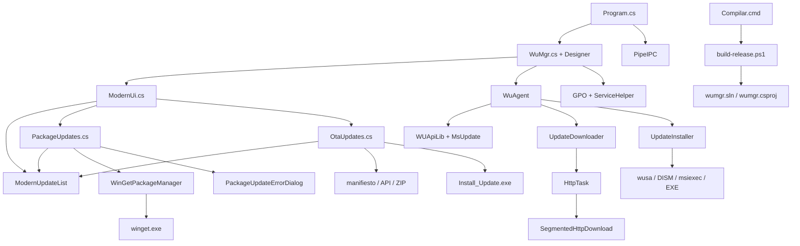

# Mapa de WinSlim Update para IA

Verificado: 2026-10-02. Rutas relativas a la raiz; `W` = `Source/wumgr/`, `C` = `Source/wumgr/Common/`. Los simbolos son anclas de busqueda, no numeros de linea que caducan. Consulta la fila de tu tarea, despues el flujo correspondiente. Amplia la lectura solo si encuentras dependencias nuevas. Este mapa orienta; no sustituye la comprobacion del codigo modificado.

## Enrutador: donde empezar

| Tarea / sintoma | Archivo y simbolos | Consumidor / comprobacion |
|---|---|---|
| Inicio, UAC, instancia unica, carpeta de trabajo, argumentos | W`Program.cs`: `Main`, `TestArg`, `GetArg`, `DoExec` | W`app.manifest`, C`PipeIPC.cs`, constructor `WuMgr` |
| Buscar / instalar / ocultar Windows Update | W`WuMgr.cs`: `btnSearch_Click`, `btnInstall_Click`, `btnHide_Click`, `OnFinished` | W`WuAgent.cs`: `SearchForUpdates`, `DownloadUpdates`, `HideUpdates` |
| COM, resultados, listas del sistema, progreso, cancelacion | W`WuAgent.cs`: `AgentOperation`, `RetCodes`, `UpdateCallback`, `OnUpdatesChanged`, `OnFinished` | W`MsUpdate.cs`, W`UpdateErrors.cs`, eventos de `WuMgr` |
| Descarga manual o catalogo offline | W`WuAgent.cs`: `DownloadUpdatesManually`, `DownloadsFinished`, `SetupOffline`; W`UpdateDownloader.cs`: `DownloadNextFile`, `OnFinished` | C`HttpTask.cs`: `TryStartSegmented`, `RespCallback`, `ReadCallBack`, `Finish`; C`SegmentedHttpDownload.cs`: `DownloadAsync`, `Range`, `ChooseConnections`; regresiones HTTP/segmentos |
| Instalacion/desinstalacion manual, bloqueos de procesos | W`UpdateInstaller.cs`: `RunInstall`, `RunUnInstall`, `CheckCab`, `ExecTask` | W`WuAgent.cs`: `InstallItemFinished`, `InstallFinished`; regresiones de procesos |
| Filtrado, agrupacion, seleccion Windows | W`WuMgr.cs`: `LoadList`, `GetUpdates`, `SwitchList`; W`ModernUi.cs`: `SyncModernUpdateList`, `UpdateMatchesModernCategory` | C`ModernUpdateList.cs`; conserva sincronizacion de `ListViewItem.Checked` |
| Tema, botones, barra lateral, ventana, layout | W`ModernUi.cs`: `InitializeModernUi`, `BuildSidebar`, `BuildMainArea`, `StyleActionButton`, `actionButton_Paint`, `UpdateModernPage` | W`WuMgr.Designer.cs` aporta controles; no cambiar paleta/tipografia por optimizacion |
| Filas, columnas, scroll, hit testing, texto truncado | C`ModernUpdateList.cs`: `SetItems`, `RebuildLayout`, `DrawRow`, `HitTestEntry`, `OnMouseDown`, `OnKeyDown` | Usado por las tres paginas; revisar las tres si cambia este control |
| Buscar/actualizar aplicaciones | W`PackageUpdates.cs`: `RefreshPackageUpdatesAsync`, `UpdateSelectedPackagesAsync`, `RebuildPackageUpdateList`, `SetPackageOperationBusy` | C`WinGetPackageManager.cs`: `FindAvailableUpdatesAsync`, `UpdatePackageAsync`, `RunAsync` |
| Parsing WinGet, argumentos, diagnosticos, logs | C`WinGetPackageManager.cs`: `ParseAvailableUpdates`, `ParseRow`, `BuildPackageSelector`, `QuoteArgument`, `ExplainWinGetExitCode`, `BuildOperationDiagnostic` | W`PackageUpdateErrorDialog.cs`; probar salida real y codigos antes de cambiar parser |
| OTAs: visibilidad, releases, cache, versiones | W`OtaUpdates.cs`: `HasOtaManifestRegistration`, `RefreshOtaUpdatesAsync`, `FetchOtaManifestAsync`, `FetchOtaReleasesFromApiAsync`, `OtaVersion.TryParse` | W`ModernUi.cs`: navegacion condicionada a `otaFeatureAvailable` |
| OTAs: descarga, integridad, ZIP, instalador | W`OtaUpdates.cs`: `ApplySelectedOtaAsync`, `VerifyOtaPackage`, `ExtractOtaPackageSafely`, `TryDeleteOtaOperationDirectory` | `Install_Update.exe` externo; no ejecutarlo como prueba automatica |
| Directivas, Store, drivers, servicios auxiliares | W`GPO.cs`: `ConfigAU`, `ConfigDriverAU`, `BlockMS`, `DisableAU`, `SetStoreAU`; C`ServiceHelper.cs` | Eventos `chk*`/`radGPO_CheckedChanged` de W`WuMgr.cs`; afectan HKLM/servicios |
| Traducciones y preferencias | W`Translate.cs`: `Load`, `fmt`; W`Program.cs`: `IniReadValue`, `IniWriteValue`; W`WuMgr.cs`: `GetConfig`, `SetConfig`, `Localize` | `Translation.ini`, `wumgr.ini`; parte de textos modernos son literales |
| Compilacion, dependencias, distribucion | `Compilar.cmd`; `Source/build-release.ps1`: `Find-MSBuild`, `$buildArguments`, `$required`; W`wumgr.csproj` | `Source/tests/run-regressions.ps1`; no usar MSBuild antiguo del Framework |

## Grafo de dependencias

Las flechas indican uso/llamada; los eventos devuelven resultados hacia la ventana.



## Flujos y contratos que preservar

**Inicio / interfaz.** `Program.Main` configura version, rutas, idioma, log e IPC; inicia `WuAgent`, despues `Application.Run(new WuMgr())`. El constructor suscribe eventos, carga preferencias y controles heredados, inicia timer/IPC y llama `InitializeModernUi`. La UI moderna reutiliza controles y estado del Designer. `ModernUpdateList` dibuja `ListViewItem`, cuya propiedad `Tag` identifica el modelo. Mantener seleccion, checks y listas visibles sincronizados.

**Detalle visual.** `ModernUpdateList.LayoutEntry.ItemIndex` conserva el indice original al reconstruir filas para alternar fondos sin buscar cada elemento durante el repintado. Separadores rectos se dibujan sin suavizado; curvas e iconos conservan antialiasing. `actionButton_Paint` indica hover en contornos y foco de teclado con la paleta existente, sin temporizadores adicionales ni cambios de layout.

`navigationButton_Paint`, `choiceControl_Paint` y `packageSelectionToggle_Paint` unifican superficies redondeadas, indicadores y estados deshabilitados/foco conservando controles y eventos nativos. `RegisterChoicePainting` se aplica a casillas compactas y casillas/radios de configuracion; no a navegacion con `Appearance.Button`. `DarkComboBoxRenderer` resalta el borde al enfocar/abrir/pasar el cursor. `RoundedPanel` dibuja el contorno dentro de la region para evitar recortes; `ApplyRoundedRegion` y `RoundedPanel.OnResize` liberan regiones anteriores. `CreateRoundedPath` limita el diametro al espacio disponible, tambien para progreso corto. Comprobacion visual parcial: render aislado de navegacion y casillas/radios; pantallas completas y DPI multiples pendientes.

**Menu lateral.** `DrawSidebarIcon` dibuja iconos vectoriales por identidad de control, sin usar `Tag` ni fuentes de iconos. `navigationButton_Paint` presenta los contadores finales `(n)` como insignias y permite etiquetas de dos lineas. El resaltado de listas Windows se suprime visualmente cuando otra pagina esta abierta, sin modificar `Checked`; `UpdateModernPage` invalida la navegacion al cambiar de pagina. `sidebarSection_Paint` separa grupos sin alterar posiciones/tamanos. Render aislado revisado con paquetes activos, contadores y etiquetas multilínea.

Pulido lateral: `sidebarSection_Paint` dibuja encabezados sin separadores. Insignias de 18 px con ceros mas discretos, iconos vectoriales de 20 px con trazo reforzado y colores existentes UiAccent/UiText, e indicador activo de 2 px. Configuracion no tiene encabezado ni opcion visible en la barra; `modernSettingsButton` permanece oculto y sin TabStop para conservar consumidores/estado y disposicion por su padre. Controles/pagina de configuracion heredados y preview interno se conservan. Render aislado revisado con Disponibles activo y sin Configuracion; no cambia geometria de opciones restantes ni agrega timers.

**Tipografia Ubuntu.** C`UiFonts.cs` carga una sola vez cuatro TTF embebidos de W`res/fonts/` en `PrivateFontCollection` y `AddFontMemResourceEx` (GDI para TextRenderer/controles nativos); familia y buffers se conservan durante el proceso. No instala fuentes en Windows. `UiFonts.Create` sirve UI, listas, tooltips, actividad y dialogo de error; `UiFonts.Apply` normaliza controles heredados al construir la ventana. Se preserva Segoe Fluent Icons solo para glifos de herramientas. `ModernUpdateList.GetItemFont` evita la fuente de sistema predeterminada de ListViewItem, reutilizando Ubuntu normal/tachada para dibujo y medicion. Lateral: encabezados 9 pt, opciones 10 pt (paquetes/OTAs 9.6 pt), altura 46/54 px para mas aire. Fuente y render lateral verificados; pantallas completas a varios DPI pendientes. Licencia UFL embebida y avisos en `Source/THIRD_PARTY_NOTICES.md`.

Ajuste de jerarquia lateral: iconos 18 px, encabezados Ubuntu Bold 9.5 pt en UiText, margenes de categorias 12 px arriba/4 abajo; bloque de marca de 118 px y encabezado Windows de 36 px para separar sus dos lineas de la primera opcion. `sidebarSection_Paint` centra el texto y respeta ForeColor sin separadores.

Por preferencia del usuario se restauran las alturas de bocadillos previas a Ubuntu: 42 px para opciones normales y 50 px para paquetes/OTAs, conservando las fuentes mayores y la separacion de encabezados.

Identidad visible: titulo superior y nombre del pie Ubuntu Bold 10.5 pt en UiText; version del pie Ubuntu 9.2 pt en UiMuted, con 21 px entre inicios de ambas lineas. Indicador activo lateral de 2 x 18 px centrado, con la misma altura que el cuadro de los iconos.

Banner inferior Windows: `BuildStatusBar` usa estado Ubuntu 10 pt en UiText y progreso de 14 px. `ModernProgressBar` dibuja pista UiBorder/contorno UiMuted dentro del area para evitar recorte, relleno UiAccent de 8 px y fondo UiSurface para esquinas limpias. Se conserva temporizador/ritmo existente. Compilacion y render aislado de estado/progreso determinado e indeterminado revisados.

Tablas compartidas: Ubuntu 10 pt para filas, grupos y encabezados (estos dos en negrita); metadatos/estado en UiAccent y errores en UiDanger. `DrawCell` y `GetTruncatedText` comparten padding efectivo, con NoPadding para evitar espacio GDI adicional. Banners de paquetes/OTAs: estado Ubuntu 10 pt UiText, progreso centrado de 14 px; motor WinGet 10 pt Bold UiAccent y version instalada OTA 10 pt UiAccent. Mantener Anchor horizontal en progreso OTA, sin Dock Fill/margenes verticales que lo compriman.

`BuildOtaStatusBar`: columnas de mensaje 320 px, progreso 160 px (barra efectiva 140 px con margenes 12/8) y espacio restante flexible. Asi el progreso permanece junto al mensaje en vez de anclarse al extremo derecho al ampliar la ventana.

`InstalledVersionBadge` en `OtaUpdates.cs` conserva el contrato Label/Text de `otaInstalledVersionLabel` y lo pinta como insignia UiInput/UiBorder: prefijo Ubuntu 9 pt y valor Ubuntu Bold 10 pt, sin cambiar posicion ni dimensiones. Fuente de prefijo reutilizada y liberada al disponer el control; valores largos usan elipsis.

**Redimensionado.** `ResizeHitTest` centraliza ocho bordes/esquinas y excluye posiciones exteriores/interiores. `WuMgr.WndProc` lo usa para WM_NCHITTEST; `WindowResizeFilter` permite arrastrar el borde aun cuando un control hijo lo cubre, despachando WM_NCLBUTTONDOWN nativo. Filtro limitado a esta ventana normal, registrado una vez y retirado en Disposed; grip escalado con DPI inicial. `ToggleMaximize`/LocationChanged ajustan MaximizedBounds al WorkingArea del monitor. Se conserva minimo 1040x680.

`ConfigureResponsiveActions` habilita wrap en barras de acciones Windows/paquetes/OTAs y ajusta la fila de pagina a los controles visibles, padding y margenes. Se ejecuta con eventos Layout/VisibleChanged/ParentChanged, con guarda contra reentrada y sin timers. Las tablas conservan columnas/scroll. `Source/tests/run-ui-layout.ps1` verifica esquinas/bordes y layout real WinForms aislado a anchos de contenido 804/944/1366/804, incluyendo ocultar una accion y volver a una fila; no inicia WuAgent ni configura Windows. Pasaron estas comprobaciones y compilacion; arrastre interactivo completo y cambios de monitor/DPI pendientes.

Correccion de primera aparicion: la altura de acciones se calcula con Width/Height/margenes de controles, no con Bottom durante un layout transitorio. Recalculo agrupado con BeginInvoke al terminar layout/SizeChanged/HandleCreated; ancho disponible de la pagina. Acciones ocultas conservan altura compacta para el mensaje de consulta. La prueba tambien fuerza un banner de 230 px y verifica su recuperacion a 62 px.

**Busqueda/cancelacion WUA.** `UpdateCallback.Invoke(ISearchJob,...)` usa Dispatcher.BeginInvoke para no bloquear el callback esperando al hilo que ejecuta EndSearch/RequestAbort. `CancelOperations` muestra CancelingOperation y solicita abortar busqueda con Task.Run, evitando bloquear UI; peticiones repetidas durante cancelacion se ignoran. `OnUpdatesFound` descarta resultados cancelados, informa Abborted aun si EndSearch falla tras cancelar y vuelve a estado idle tambien ante excepciones de procesamiento/cache/UI. No se declara terminada una operacion nativa que aun no ha notificado finalizacion. Consulta WUA y preparacion de resultados tienen tiempos separados en actividad; se reutiliza Title del modelo para evitar lectura COM redundante. Criterios y origen de busqueda se conservan.

`Source/tests/run-search-regressions.ps1` usa interfaces WUA simuladas y el WuAgent real sin constructor/inicializar servicio: aborto lento sin bloquear UI, callback que retorna antes de EndSearch, error al finalizar cancelacion, resultado invalido y retorno a idle. No ejecuta busquedas reales ni cambia Windows. Pruebas de layout, busqueda simulada y regresiones HTTP/instalador pasaron; tiempos y cancelacion con servicio WUA real pendientes de verificar.

Handoff de busqueda corregido para WinForms: el constructor de WuMgr registra `WindowsFormsSynchronizationContext` con `SetSearchUiContext`; `PostSearchToUi` usa Post para completion y errores de aborto (Dispatcher.BeginInvoke solo como fallback sin ventana). Las pruebas ahora bombean Application.DoEvents, sin Dispatcher.PushFrame. `OnTimedEvent` llama `PollSearchCompletion`: como maximo una consulta IsCompleted por segundo, en worker con exclusión Interlocked, y finalizacion idempotente por identidad de job. Recupera callbacks ausentes cuando WUA ya termino; no declara finalizado un job nativo aun activo. Caso de callback suprimido probado, junto a aborto lento/error de EndSearch/layout.

Revision de handoff: callback nativo usa ahora `CompleteSearchOnUi` con SynchronizationContext.Send (fallback Dispatcher.Invoke), manteniendo vivo el callback mientras se consume EndSearch, como el flujo original. RequestAbort sigue en worker; PostSearchToUi se reserva para polling/errores. Prueba EndSearch simulada comprueba IsCompleted, sin exigir que el callback haya retornado (EndSearch dentro de callback es valido). Diagnostico WUA real Online=false, sin cambiar configuracion: 7 resultados almacenados, 6 pendientes, modelos/cache temporal preparados en ~0.1 s y agente idle. Esta prueba no cubre la ventana completa ni consulta online; log del usuario mostraba consulta online de 101.2 s sin linea posterior de preparacion. Copia de Release bloqueada por proceso activo al intentar actualizarla.

**Revision y reinicio previo autorizado.** Usuario confirmo que reiniciar wuauserv recupero la busqueda. `ConfigureOnlineSearcher` restablece Online=true, selecciona ssOthers+ServiceID para proveedor explicito y ssManagedServer para gestionado; fallback ssDefault. Offline usa Online=false. `OnUpdatesFound` descarta resultados fallidos antes de sustituir listas y construye listas temporales; CleanUp se ejecuta en worker fuera del callback, incluso con aborto/error.

La sobrecarga online publica llama `StartWindowsSearch(true)`: CheckingUpdates/OnProgress normal -> `WindowsUpdateServiceRecovery.Restart` en Task -> recreacion de IUpdateSearcher con origen/opciones conservadas -> `BeginWindowsSearch`. Solo AppLog/Ver actividad menciona el reinicio; no cambia el banner a estados de servicio. Servicio parado se inicia, transiciones pendientes se esperan y servicio activo se detiene/inicia con limite de 30 s por espera. No cambia tipo de inicio ni fuerza dependientes activos. Cancelar durante preparacion evita lanzar el scan tras restaurar el servicio. Catalogo offline y transicion tras descargar CAB usan StartWindowsSearch(false), preservando registro offline. Tests compilan el helper real con adaptador simulado y cubren Running/Stopped/StartPending/StopPending/timeout; sin reinicios reales para validar. Compilacion y regresiones de busqueda pasan.

**Cancelacion logica sin espera nativa.** Para un ISearchJob activo, `CancelOperations` retira job/callback, informa Abborted inmediatamente y mantiene aborto/CleanUp/EndSearch en worker usando el searcher capturado. Esto cancela la espera de la app, no certifica que WUA ya detuvo el trabajo. Un callback posterior se ignora por identidad. Proxima consulta online/offline usa un IUpdateSearcher nuevo, separado del descartado; preparacion de reinicio sigue esperando restaurar el servicio antes de completar cancelacion. Tests verifican UI idle antes del aborto simulado lento y que la finalizacion tardia no borra una busqueda nueva.

`searchPollJob` usa CompareExchange por identidad para que un polling viejo no bloquee ni libere el de la consulta nueva. `BeginWindowsSearch` registra envio/aceptacion del scan; `PollSearchCompletion` registra cada 30 s la espera de respuesta WUA solo en actividad, conservando el banner normal. No reinicia servicios desde polling ni establece un plazo artificial de exito. Evento real observado anteriormente 0x80244022 (HTTP 503); no atribuirlo a esta consulta sin correlacionar actividad/eventos actuales.

**Windows / COM.** UI -> agente -> trabajo COM -> `UpdateCallback` -> Dispatcher -> eventos `Progress`, `Finished`, `UpdatesChaged` (nombre heredado). `MsUpdate.Entry` puede invalidarse; se recupera mediante `GetUpdate`/`FindUpdate`. `mCurOperation` gobierna busy/cancelacion; comprobar ese estado antes de iniciar otro trabajo. `EnableWuAuServ` habilita inicio manual y espera a `wuauserv`; no introducir controles para deshabilitarlo.

**Modo manual.** Agente crea tareas URL/KB -> downloader secuencial por archivo -> `HttpTask` escribe `.tmp` y finaliza -> `DownloadsFinished` filtra archivos fallidos/inexistentes -> installer secuencial -> `ItemFinished` actualiza pendientes/instaladas -> `Finished` devuelve resultado y reinicio. Una lista sin archivos no equivale a instalacion correcta. Un error HTTP ya no declara exito por existir un archivo previo; lo conserva sin anunciarlo como descarga correcta. Catalogo offline fallido no debe anunciarse como descargado.

**HTTP adaptativo.** `HttpTask(Update=true)` activa `SegmentedHttpDownload` solo con respuesta final de CDN Microsoft permitido, >=64 MiB, ETag fuerte y sin Content-Encoding. La cola de archivos no cambia; WUA nativo, WinGet y OTA HttpClient conservan sus motores. Se reutilizan muestras contiguas utiles: 2 MiB de calentamiento, 2 MiB a 1 conexion, 4 MiB a 2; prueba 8 MiB a 4 solo si 2 supera 1 al menos 20%. `ChooseConnections` exige 20% adicional para subir a 4; es una politica conservadora, no un limite publicado por Microsoft. Si gana 1, resto en una respuesta larga; 2/4 usan rondas de fragmentos de 4 MiB. SemaphoreSlim limita a 4 peticiones segmentadas activas en el proceso. ConnectionGroup propio se cierra al terminar; solo ajusta ServicePoint local del proceso, no politicas de Windows.

Cada rango exige HTTP 206, Content-Range exacto inicio/fin/total, Content-Length exacto, mismo ETag y codificacion sin compresion; usa If-Range y offsets Int64. Streams separados escriben posiciones disjuntas del .tmp preasignado, sin ensamblado extra; no se publica hasta verificar todos los rangos/longitud. Cancelacion aborta todas las peticiones y borra parciales. Error/servidor que ignora rangos cambia una sola vez a GET simple; 429/503 recoge el mayor Retry-After de las peticiones fallidas (5 s si falta), espera hasta 60 s cancelables y no reintenta automaticamente cuando supera ese plazo. Timeout 30 s de cabeceras/inactividad por rango. No equivale a validacion criptografica del paquete; conserva verificaciones posteriores del instalador.

Cooldown 429/503 se conserva en memoria por familia CDN para los archivos siguientes, incluido GET simple; no modifica INI/Windows. Esperas cortas son cancelables; con >60 s Start devuelve false sin enviar peticion. HttpTask usa referencias volatiles/copia local para evitar carrera de Cancel al cambiar de peticion. Pruebas cubren tambien cancelacion durante espera y bloqueo de la siguiente descarga mientras rige Retry-After.

**Medicion y pruebas HTTP.** 2026-10-07: https://catalog.s.download.windowsupdate.com/microsoftupdate/v6/wsusscan/wsusscn2.cab admitio rangos/ETag fuerte. Benchmark acotado de 24.25 MiB, seis tandas de 4 MiB en orden 1/2/4/4/2/1 tras 256 KiB de calentamiento. Datos en `Source/tests/http-download-benchmark.csv`: medias ~10.35/9.40/10.26 MiB/s para 1/2/4, sin ventaja estable del paralelo en ese entorno. No prueba un optimo universal. `run-segmented-downloads.ps1` compila clases reales y servidor/proxy TCP local: compara todos los bytes de 64 MiB, valida rechazo de rangos/ETag/truncado, limite de concurrencia, fallback unico, HTTP 500 con archivo previo y cancelacion durante segmentos/Retry-After. Proxy se cambia solo en el proceso de prueba, no en Windows. No instala actualizaciones ni descarga paquetes completos de Microsoft para validar.

Benchmark repetible explicitamente con `Source/tests/measure-microsoft-ranges.ps1` (24.25 MiB de trafico, no forma parte de regresiones normales). `MicrosoftRangeBenchmark.cs` valida respuesta parcial y rango exacto y limita cada muestra a 15 s. El resultado guardado es una medicion puntual; no justificar mas conexiones solo por el numero de partes.

**Procesos manuales.** MSU=wusa, CAB=DISM, MSI=msiexec, EXE=argumentos heredados. ZIP busca el primer formato compatible. `ExecTask` y `CheckCab` drenan stdout/stderr simultaneamente antes de finalizar para evitar bloqueos. Cancelar no mata un instalador activo: impide continuar y evita marcar como correcta una instalacion interrumpida. Callbacks de HTTP usan Dispatcher; workers de instalacion retornan con `BeginInvoke`. No hacer `Join` mientras el worker espera `Invoke` sincrono.

**Paquetes.** UI async -> WinGet query -> parser de tabla -> `PackageUpdateInfo` -> filtro/checks -> actualizaciones secuenciales. `RunAsync` drena ambas salidas, registra cancelacion y usa TEMP propio para WinGet elevado. Diagnostico combina codigo, salida y logs; el dialogo permite copiar/reintentar. Busy y `CancellationTokenSource` se restauran en `finally`; no mezclar estado con Windows Update.

**OTA.** Registro HKLM `SOFTWARE\Microsoft\Windows\CurrentVersion\OEMInformation`, valor REG_SZ `OTAManifestVersion`, vistas 32/64 bits. Solo tags `WS11OTA_X.Y.Z`. Consulta manifiesto de `Christianlg97/WinSlim11_OTAs`, respaldo API y cache local si falla. Compara versiones numericamente. Aplicar: descarga -> verifica tamaño/SHA256 cuando publicados -> valida rutas de extraccion -> encuentra instalador -> espera salida -> limpia temporal. Sin hash publicado no hay comprobacion SHA256. No reducir validacion de rutas/URL ni borrar temporal mientras el instalador sigue vivo.

## Archivos, recursos y limites de lectura

| Ruta | Uso / propietario |
|---|---|
| W`Properties/AssemblyInfo.cs` | Version de ensamblado/archivo, metadatos; `Compilar.cmd` modifica ambas |
| W`App.config`, W`app.manifest` | Runtime 4.6.1, DPI, UAC obligatorio |
| W`Properties/Resources.resx`, W`WuMgr.resx`, W`wu.ico`, W`res/` | Recursos; archivos `.Designer.cs` generados salvo Designer de ventana heredada |
| W`lib/Interop.WUApiLib.dll`, W`lib/Interop.TaskScheduler.dll` | Dependencias COM incluidas y copiadas a salida |
| C`AppLog.cs`, `FileOps.cs`, `MiscFunc.cs`, `KnownFolders.cs` | Log despachado, archivos/permisos, helpers Win32, carpetas conocidas |
| C`TokenManipulator.cs`, `WinConsole.cs`, `MultiValueDictionary.cs` | Privilegios, consola opcional, archivos multiples por KB |
| `Source/Tools/Defender Update/` | Scripts heredados de tareas programadas; sin menu moderno visible |
| `wumgr.ini`, `Translation.ini`, `Updates/updates.ini`, `ota-cache.json` | Datos de ejecucion bajo `Program.wrkPath`; no son codigo ni defaults fiables |
| `%TEMP%/WinSlimUpdate/OTA_*/` | Descarga/extraccion OTA temporal; `%TEMP%/.../ElevatedWinGetTemp/` para WinGet |
| `README.md`, `Source/DOCUMENTACION.md`, `CHANGELOG.md` | Documentacion humana; leer solo si la tarea necesita semantica de producto/historial |
| `LICENSE`, `THIRD_PARTY_NOTICES.md`, `PRIVACY_POLICY.md` | Licencias, atribuciones y privacidad; consultar al cambiar dependencias o conexiones |
| `bin/`, `obj/`, `Source/.build-deps/`, `Release/` | Salidas/cache; excluir de busquedas del codigo |

`Program.wrkPath` intenta la carpeta del EXE y usa Downloads/WuMgr si no puede escribir. No almacenar preferencias en la carpeta fuente por asumir que coincide con el directorio de trabajo.

## Compilar y verificar

```powershell
powershell -NoProfile -ExecutionPolicy Bypass -File Source/build-release.ps1
powershell -NoProfile -ExecutionPolicy Bypass -File Source/build-release.ps1 -NoInstall -CopyToRelease
powershell -NoProfile -ExecutionPolicy Bypass -File Source/tests/run-regressions.ps1
```

`-Configuration` acepta Release/Debug. MSBuild: vswhere -> rutas VS2022 -> instalador oficial firmado de Build Tools. Referencias 4.6.1: targeting pack instalado -> paquete oficial NuGet 1.0.3 en cache local + rutas MSBuild explicitas. No usar GAC como sustituto de targeting pack ni distribuir ensamblados de referencia. La salida obligatoria incluye EXE, config y las dos DLL; PDB opcional. Las DLL COM ausentes se restauran del repositorio, no se descargan de terceros.

Regresiones: clases reales HTTP/downloader/installer con colaboradores minimos, servidor TCP local y proceso inocuo de salida abundante. Cubren inicio fallido, cancelacion reportada, instalacion sin archivos, stdout/stderr, nombres de descarga y archivo truncado con longitud mayor de 2 GB. No cubren instalaciones reales, COM, WinGet, politicas ni GUI. Release y estas pruebas pasaron en la revision indicada; instalacion de Build Tools no ejecutada porque ya estaba presente. Fallback de referencias descargado y compilado efectivamente.

Vista de UI sin agente real: argumentos internos `-preview -preview-list`, `-preview -preview-settings`, `-preview -preview-packages`, `-preview -preview-otas`. El manifiesto sigue exigiendo UAC y el constructor lee configuracion; estos modos no son una sandbox ni una prueba de instalacion.

## Consultas pequenas y mantenimiento

```powershell
rg -n 'DownloadsFinished|InstallItemFinished' Source/wumgr/WuAgent.cs
rg -n 'RefreshPackageUpdatesAsync|UpdateSelectedPackagesAsync' Source/wumgr/PackageUpdates.cs
rg -n 'VerifyOtaPackage|ApplySelectedOtaAsync' Source/wumgr/OtaUpdates.cs
rg --files Source -g '*.cs' -g '!**/bin/**' -g '!**/obj/**' -g '!**/.build-deps/**'
```

Lee unas decenas de lineas alrededor del simbolo encontrado, despues sus llamadores. Usa `git diff` para verificar alcance. Al ampliar una funcion, sigue la pareja UI/motor de la tabla; al añadir un `.cs`, registralo en el csproj clasico. Actualiza mapa y grafo solo cuando cambien, conserva hechos comprobados y etiqueta pruebas pendientes. No declares verificacion de estetica o del sistema a partir de una compilacion correcta.
